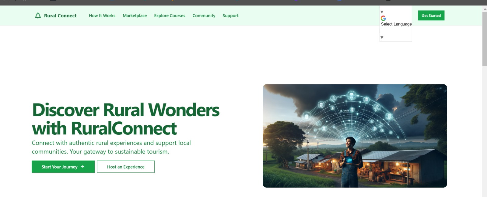

# 🌄 RuralConnect: FinTech Based Rural Tourism & Marketplace Platform

### Empowering Rural Economies Through FinTech based Sustainable Tourism and Blockchain-Powered Commerce

---
## 🖼️ Project Screenshot

Here’s a preview of the RuralConnect platform:


---
## 🚀 Overview

**RuralConnect** bridges the gap between global travelers and local guides, offering an authentic way to experience rural areas. It includes a marketplace for rural products, blockchain-secured payments, and online certification for tourism professionals. A FinTech-based solution aimed at generating employment in rural areas by connecting local guides with global travelers through a blockchain-secured platform, fostering sustainable tourism, cultural exchange, and economic empowerment

---

### ✨ Key Features

| Feature                        | Description                                                                                                 |
| ------------------------------ | ----------------------------------------------------------------------------------------------------------- |
| 🧭 **Guide Booking Platform**  | Book local guides for authentic experiences with secure, blockchain-based payments and reviews.             |
| 🛒 **Marketplace for Sellers** | Connect rural artisans and farmers with buyers globally, ensuring safe transactions through blockchain.     |
| 📚 **Skill Certification**     | Online courses and blockchain certification for tourism professionals, supporting skill development.        |
| 🔒 **Escrow Payments**         | Secure escrow-based payment system for bookings and transactions, ensuring fair dealings for all parties.   |
| 🤖 **AI Chatbot**              | Real-time AI-powered assistance for travelers, guides, and sellers, providing personalized recommendations. |

---

### 📊 Business Model

| Revenue Stream                     | Details                                                                              |
| ---------------------------------- | ------------------------------------------------------------------------------------ |
| 💸 **Transaction Commissions**     | Small commission (5-10%) on bookings and marketplace transactions.                   |
| 📅 **Subscription Fees**           | Monthly/annual fees for premium access for guides, sellers, and institutes.          |
| 🔒 **Escrow Service Fees**         | Fees for escrow-based payments to enhance transaction security.                      |
| 📜 **Course & Certification Fees** | Revenue from professional courses and blockchain-based skill certification issuance. |
| 📈 **Advertising**                 | Ad revenue from local businesses and partners for featured placements.               |

---

### 🌐 Technologies Used

- **Blockchain**: For escrow payments, secure transactions, and certification issuance.
- **AI Chatbot**: Offers real-time support and personalized recommendations.
- **Web & Mobile Interface**: Intuitive, user-friendly design for seamless interaction.

---

### 📈 Market Feasibility

| Category                   | Metric                                     |
| -------------------------- | ------------------------------------------ |
| 📱 **Smartphone Usage**    | Over 60% of rural Indians own smartphones. |
| 🌍 **Tourism Demand**      | 15% annual growth in sustainable tourism.  |
| 🛒 **E-commerce in Rural** | 40% annual increase in rural e-commerce.   |

---

## 🔧 Installation

### Prerequisites

- A **web browser** to access the platform.
- A **digital wallet** (e.g., MetaMask) for blockchain transactions.
- **Internet access** for courses, bookings, and marketplace browsing.

### Setup Instructions

1. **Clone the Repository**
   ```bash
   git clone https://github.com/Lavinasevani/RuralConnect.git
   cd RuralConnect
   ```


2. **Install Dependencies**  
   Ensure you have `Node.js`, `Python`, and `Solidity` installed. Then run:

   ```bash
   npm install    # for front-end dependencies
   pip install -r requirements.txt    # for back-end dependencies
   ```

3. **Run the Application**  
   Start the backend server:

   ```bash
   python app.py
   ```

   And then the frontend:

   ```bash
   npm start
   ```

4. **Access the Platform**  
   Open [http://localhost:5713](http://localhost:5713) in your browser.

---

### 📈 Data Visualization

| Metric                    | 2023 Data (%) | Projected Growth (%) |
| ------------------------- | ------------- | -------------------- |
| Smartphone Adoption       | 60%           | +15%                 |
| Rural E-commerce Adoption | 25%           | +40%                 |
| Annual Tourism Growth     | 10%           | +15%                 |

### 🛠️ Maintenance and Contribution

1. **Issue Reporting**: For bugs or feature requests, open an issue.
2. **Code Contributions**: Fork the repository, make your changes, and submit a pull request.
3. **Documentation Updates**: Contributions to improve the README and documentation are welcome!

---

## 👥 Contributors

This project is maintained by [Lavinasevani] and supported by contributions from developers and tourism professionals.

---

## 📬 Contact

For inquiries, contact us at:

- **Website**: [www.RuralConnect.com](https://www.RuralConnect.com)

---
